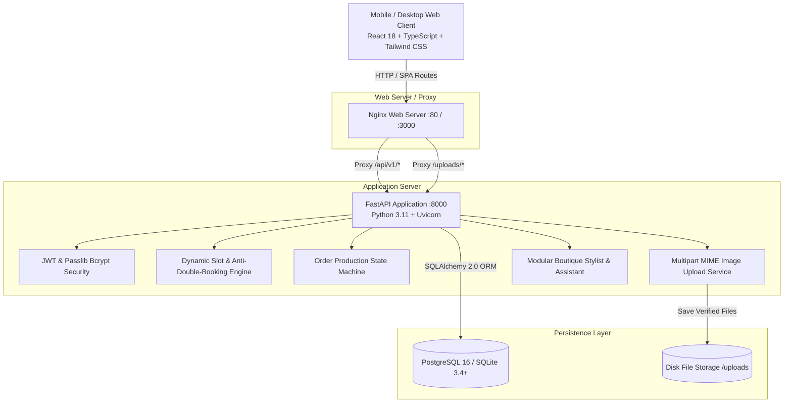

# SILAICRAFT COUTURE — MASTER TECHNICAL & USER DOCUMENTATION
## Full-Stack Women's Tailoring & Boutique Studio Management Platform

---

# 1. EXECUTIVE SUMMARY & SYSTEM OVERVIEW

**SilaiCraft Couture** is an enterprise-grade, mobile-first web application engineered specifically for bespoke women's tailoring boutiques, designer fashion ateliers, and custom apparel studios.

The platform digitizes the entire lifecycle of custom garment manufacturing:
1. **Customer Discovery & Consultation**: Public service catalog, inspiration design gallery, and virtual AI stylist.
2. **Precision Sizing Vault**: Customer-managed custom measurement profiles for diverse Indian and Western garments (Blouses, Kurtis, Salwar Suits, Lehengas, and Gowns).
3. **Appointment Scheduling Engine**: Dynamic slot availability with anti-double-booking protection, configurable business hours, buffer intervals, and fitting room capacity limits.
4. **Custom Stitching Quotation System**: Inquiry submission with reference photo uploads (Pinterest/Instagram inspirations) and custom quotation generation with itemized cost formulas.
5. **Production Workflow Pipeline**: Granular state machine progression (*Order Received* $\rightarrow$ *Measurements Confirmed* $\rightarrow$ *Cutting* $\rightarrow$ *Stitching* $\rightarrow$ *Quality Check* $\rightarrow$ *Ready* $\rightarrow$ *Delivered*) with real-time customer timeline tracking.
6. **Financial Management**: Multi-stage installment recording (Advance & Balance settlement) across Cash, UPI, Card, and Net Banking.
7. **Customer CRM & Business Intelligence**: Comprehensive client histories, lifetime revenue tracking, and 6-month visual sales analytics.

---

# 2. SYSTEM ARCHITECTURE



---

# 3. TECHNOLOGY STACK

| Layer | Technologies | Description |
| :--- | :--- | :--- |
| **Backend Framework** | FastAPI 0.115+, Python 3.11+ | High-performance asynchronous REST API with Pydantic v2 validation. |
| **ORM & Database** | SQLAlchemy 2.0, Alembic, PostgreSQL 16 / SQLite | Declarative ORM models with UUID primary keys, UTC timestamps, and migrations. |
| **Authentication** | Passlib (Bcrypt), Python-Jose (JWT) | Stateless JWT authentication with Role-Based Access Control (RBAC). |
| **Frontend Framework** | React 18, TypeScript, Vite 5 | Single Page Application with optimized bundle splitting and type safety. |
| **Styling & Icons** | Tailwind CSS 3.4, Lucide React | Mobile-first utility styling with touch targets $\ge 44\text{px}$ and smooth animations. |
| **State & Networking** | React Context API, Axios Interceptors | Centralized auth, boutique settings, and toast notifications. |
| **Web Server & Containers** | Docker, Docker Compose, Nginx Alpine | Multi-container deployment with SPA fallback and asset caching. |
| **Automated Testing** | Pytest, Pytest-Asyncio, HTTPX | 10 comprehensive backend integration tests covering all critical paths. |

---

# 4. HOW TO RUN & START THE PROJECT

### Prerequisites
- **Python 3.10+ or 3.11+**
- **Node.js 18+ & npm**
- *(Optional)* **Docker & Docker Compose**

---

### Option A: Local Development Setup (Recommended for Local Testing)

#### Step 1: Start the Backend Service
Open your terminal (PowerShell on Windows, Bash on macOS/Linux):

```bash
# 1. Navigate to the backend directory
cd "d:/Ai Projects/fashion/backend"   # Or your project path

# 2. Create and activate a Python virtual environment
# Windows:
python -m venv venv
.\venv\Scripts\activate
# macOS/Linux:
python3 -m venv venv
source venv/bin/activate

# 3. Install required Python packages
pip install -r requirements.txt

# 4. Apply database schema migrations
alembic upgrade head

# 5. Seed the database with demo boutique data, services, designs, and accounts
python -m app.seed.seed_data

# 6. Start the FastAPI development server
uvicorn app.main:app --reload --port 8000
```
- **Backend API Base**: `http://127.0.0.1:8000`
- **Interactive Swagger Documentation**: `http://127.0.0.1:8000/docs`
- **Redoc Documentation**: `http://127.0.0.1:8000/redoc`

---

#### Step 2: Start the Frontend Application
Open a **second terminal window**:

```bash
# 1. Navigate to the frontend directory
cd "d:/Ai Projects/fashion/frontend"

# 2. Install frontend dependencies (if not done already)
npm install

# 3. Start the Vite development server
npm run dev
```
- **Frontend URL**: `http://localhost:5173`

---

### Option B: Run with Docker Compose (Production-Grade Containerized Stack)

To run the complete stack including PostgreSQL, the FastAPI application, and the Nginx-hosted frontend:

```bash
# From the project root folder:
cd "d:/Ai Projects/fashion"

# Build images and start all containers
docker-compose up --build
```

**Access URLs:**
- **Storefront & Customer Portal**: `http://localhost` (or `http://localhost:3000`)
- **Backend API & Swagger Docs**: `http://localhost:8000/docs`
- **PostgreSQL Database**: Port `5432` (`user: postgres`, `password: postgres`, `db: fashion_db`)

---

# 5. USER ACCOUNTS & ACCESS CREDENTIALS

The database seeder automatically initializes the following verified accounts:

### 1. Boutique Administrator (Atelier Master)
- **Email**: `admin@silaicraft.com`
- **Password**: `Admin@123456`
- **Role**: `ADMIN`
- **Portal Access**: `/admin`
- **Capabilities**: Full access to dashboard analytics, appointment approvals, production order pipeline, quotation generator, manual payment records, review moderation, customer directory, service & design management, and boutique configuration.

### 2. Registered Customer (Sample Client)
- **Email**: `priya@example.com`
- **Password**: `Customer@123456`
- **Role**: `CUSTOMER`
- **Portal Access**: `/dashboard`
- **Capabilities**: Book appointments, save custom sizing profiles, submit bespoke tailoring requests, accept quotations, track order timelines, view payment receipts, leave reviews, and chat with the AI stylist.

*(Note: On the `/login` page, convenient one-click "Demo Admin" and "Demo Customer" buttons are available for instant access).*

---

# 6. DETAILED FUNCTIONALITY BREAKDOWN

## 6.1. Public Storefront Experience

| Feature | Route | Description |
| :--- | :--- | :--- |
| **Homepage** | `/` | Hero section with high-resolution imagery, trust statistics (15+ yrs, 100% fit guarantee), service preview, 4 pillars of craftsmanship, 5-step visual journey, verified customer testimonials, and floating AI assistant. |
| **About Atelier** | `/about` | Boutique history, master tailoring philosophy, fabric care, and double-seam allowance guarantees. |
| **Services Catalog** | `/services` | Filterable by category (Blouses, Traditional Wear, Kurtis, Gowns, Alterations) with starting prices and estimated days. |
| **Service Detail** | `/services/:id` | High-res image, inclusions list (pre-washed cotton canvas lining, YKK zippers, 2-inch margins), starting price, and direct "Book Slot" CTA. |
| **Design Gallery** | `/designs` | Atelier portfolio with tag filtering, category pills, search bar, and interactive design inspection modal with a "Request This Design" action. |
| **Contact Atelier** | `/contact` | Store location, operating hours, phone, direct WhatsApp click-to-chat button, and interactive inquiry form storing messages in DB. |
| **Authentication** | `/login`, `/register`, `/forgot-password` | Secure JWT login, registration with password validation, and password reset request. |

---

## 6.2. Customer Portal Experience

| Feature | Route | Description |
| :--- | :--- | :--- |
| **Dashboard** | `/dashboard` | Mobile-stacked KPI cards showing next upcoming appointment, active orders count, pending balance, recent order summary, and saved measurement profile cards. |
| **Sizing Vault** | `/measurements` | Create, edit, and manage custom sizing profiles for Blouses (10 body dimensions), Kurtis, Salwar Suits, Lehengas, and Gowns. Supports setting default profiles. |
| **5-Step Mobile Booking** | `/appointments/book` | **Step 1**: Select Service $\rightarrow$ **Step 2**: 14-day horizontal date picker $\rightarrow$ **Step 3**: Available slot chips $\rightarrow$ **Step 4**: Attach measurements/inspiration $\rightarrow$ **Step 5**: Review & Confirm. |
| **Appointment History** | `/appointments` | List of upcoming and completed trial sessions with cancel action for eligible pending/confirmed slots. |
| **Custom Inquiries** | `/custom-requests` | View submitted custom design requests, inspect attached photos, and review received quotations with **Accept** or **Decline** actions. |
| **Request Custom Stitching** | `/custom-requests/create` | Upload reference images (Pinterest/Instagram), specify garment category, fabric type, preferred colors, occasion date, and link saved measurement profiles. |
| **My Orders** | `/orders` | Complete list of active and completed tailoring jobs with price, remaining balance, and live progress indicators. |
| **Live Order Tracking** | `/orders/:id` | Vertical mobile progress tracker (*Order Received* $\rightarrow$ *Measurements Confirmed* $\rightarrow$ *Cutting* $\rightarrow$ *Stitching* $\rightarrow$ *Quality Check* $\rightarrow$ *Ready* $\rightarrow$ *Delivered*), payment breakdown, attached measurements, and **Review Submission Modal** upon delivery. |
| **Payment Receipts** | `/payments` | Audit log of all payments (Advance and Final settlement) with transaction references and dates. |
| **Notification Center** | `/notifications` | Real-time alerts for appointment confirmations, quotation generation, and order stage transitions with "Mark All Read" support. |
| **Virtual AI Stylist** | *Chat Modal* | Instant virtual assistant answering questions on blouse necklines, fabric recommendations, turnaround estimates, and booking links. |

---

## 6.3. Boutique Admin & Atelier Studio Experience

| Feature | Route | Description |
| :--- | :--- | :--- |
| **Admin Dashboard** | `/admin` | Real-time atelier KPIs: Total Customers, Active Production Jobs, Today's Appointments, Monthly Revenue, 6-Month Visual Revenue Graph, Order Status Distribution, and Top Categories. |
| **Production Orders** | `/admin/orders` | Searchable directory by order number or customer name, filterable by stage. |
| **Order Production Manager** | `/admin/orders/:id` | State machine advance buttons (e.g. *Advance to Cutting*, *Advance to Stitching*), custom master tailor notes logger, and **Record Payment Modal** (Cash, UPI, Card, Net Banking). |
| **Appointments Schedule** | `/admin/appointments` | Date-filtered calendar schedule with **Confirm**, **Mark Completed**, **Decline**, and **Mark No-Show** actions. |
| **Custom Requests Queue** | `/admin/custom-requests` | Review customer-uploaded inspiration photos, fabric specs, and open the **Quotation Builder Modal**. |
| **Quotation Builder** | `/admin/custom-requests` | Formula calculator: $\text{Base Price} + \text{Extra Charges} - \text{Discount} = \text{Final Amount}$, sets required advance and validity period. |
| **Quotations Log** | `/admin/quotations` | List of all quotations with status; 1-click **Convert to Production Order** for accepted quotes. |
| **Customer CRM** | `/admin/customers` | Searchable directory displaying total jobs, lifetime revenue, and account active/deactivate toggle. |
| **Customer Deep Profile** | `/admin/customers/:id` | Complete view of customer's saved measurements, appointment history, order pipeline, and payment receipts. |
| **Service Catalog CRUD** | `/admin/services` | Add, edit, upload photos, change prices, turnaround times, and toggle active status. |
| **Design Gallery CRUD** | `/admin/designs` | Upload new designs, assign categories, manage searchable tags (`#zardozi`, `#velvet`), and toggle active status. |
| **Payment Audits** | `/admin/payments` | Master transaction ledger across all payment methods. |
| **Review Moderation** | `/admin/reviews` | Approve, hide, or delete customer ratings and reviews. |
| **Reports & Analytics** | `/admin/reports` | Category volume breakdowns, average order values, and printable/exportable PDF reports. |
| **Inquiries & Contact Log** | `/admin/contact` | Manage incoming storefront messages with **Mark Replied** and **Archive** actions. |
| **Boutique Settings** | `/admin/settings` | Configure business name, phone, email, address, WhatsApp click-to-chat number, slot duration (minutes), and fitting room capacities. |

---

# 7. DATABASE SCHEMA & DATA MODELS

The application contains **15 complete ORM models** defined in [`backend/app/models/`](file:///d:/Ai%20Projects/fashion/backend/app/models):

### 1. `users` & `customer_profiles`
- `id` (UUID, Primary Key)
- `name` (String, Indexed)
- `email` (String, Unique, Indexed)
- `phone` (String, Indexed)
- `hashed_password` (String)
- `role` (Enum: `CUSTOMER`, `ADMIN`)
- `is_active` (Boolean, Default: True)
- `profile` (One-to-One with `customer_profiles`: address, city, pincode, preferences)

### 2. `services`
- `id` (UUID, Primary Key)
- `name` (String, Indexed)
- `category` (Enum: `BLOUSE`, `TRADITIONAL`, `DRESSES`, `KURTIS`, `ALTERATIONS`)
- `description` (Text)
- `price` (Float)
- `estimated_days` (Integer)
- `image` (String)
- `is_active` (Boolean, Default: True)

### 3. `designs`
- `id` (UUID, Primary Key)
- `title` (String, Indexed)
- `category` (Enum: `BLOUSE`, `BRIDAL`, `KURTI`, `LEHENGA`, `GOWN`, `EMBROIDERY`, `DESIGNER`)
- `description` (Text)
- `image` (String)
- `price` (Float, Optional)
- `tags` (JSON Array, e.g. `["velvet", "zardozi", "deep-back"]`)
- `is_active` (Boolean, Default: True)

### 4. `measurement_profiles`
- `id` (UUID, Primary Key)
- `customer_id` (UUID, Foreign Key $\rightarrow$ `users.id`)
- `name` (String)
- `garment_type` (Enum: `BLOUSE`, `KURTI`, `SALWAR_SUIT`, `LEHENGA`, `GOWN`, `CUSTOM`)
- `measurements` (JSON Dictionary: keys like `bust`, `under_bust`, `waist`, `shoulder`, `armhole`, `sleeve_length`, etc.)
- `is_default` (Boolean)

### 5. `appointments`
- `id` (UUID, Primary Key)
- `customer_id` (UUID, Foreign Key $\rightarrow$ `users.id`)
- `service_id` (UUID, Foreign Key $\rightarrow$ `services.id`)
- `measurement_profile_id` (UUID, Optional Foreign Key $\rightarrow$ `measurement_profiles.id`)
- `appointment_date` (Date, Indexed)
- `start_time` (String, e.g. "10:45")
- `end_time` (String, e.g. "11:30")
- `status` (Enum: `PENDING`, `CONFIRMED`, `COMPLETED`, `CANCELLED`, `NO_SHOW`)
- `notes` (Text, Optional)
- `reference_image` (String, Optional)

### 6. `custom_requests` & `custom_request_images`
- `id` (UUID, Primary Key)
- `customer_id` (UUID, Foreign Key $\rightarrow$ `users.id`)
- `design_id` (UUID, Optional Foreign Key $\rightarrow$ `designs.id`)
- `garment_type` (String)
- `description` (Text)
- `fabric`, `preferred_color`, `occasion` (String)
- `required_date` (Date)
- `status` (Enum: `SUBMITTED`, `REVIEWING`, `QUOTATION_SENT`, `ACCEPTED`, `REJECTED`, `CONVERTED_TO_ORDER`)
- `images` (One-to-Many with `custom_request_images`: `file_path`)

### 7. `quotations`
- `id` (UUID, Primary Key)
- `custom_request_id` (UUID, Foreign Key $\rightarrow$ `custom_requests.id`)
- `customer_id` (UUID, Foreign Key $\rightarrow$ `users.id`)
- `base_price`, `additional_charges`, `discount`, `final_amount`, `advance_amount` (Float)
- `valid_until` (Date)
- `status` (Enum: `PENDING`, `ACCEPTED`, `REJECTED`, `EXPIRED`)
- `notes` (Text)

### 8. `orders` & `order_status_history`
- `id` (UUID, Primary Key)
- `order_number` (String, Unique, Indexed, e.g. "ORD-20260828-A1B2")
- `customer_id` (UUID, Foreign Key $\rightarrow$ `users.id`)
- `service_id`, `design_id`, `measurement_profile_id`, `custom_request_id` (Foreign Keys)
- `price`, `advance_amount`, `remaining_amount` (Float)
- `expected_delivery_date` (Date)
- `status` (Enum: `ORDER_RECEIVED`, `MEASUREMENTS_CONFIRMED`, `CUTTING`, `STITCHING`, `QUALITY_CHECK`, `READY`, `DELIVERED`, `CANCELLED`)
- `status_history` (One-to-Many audit log with timestamp, status, actor, and notes)

### 9. `payments`
- `id` (UUID, Primary Key)
- `order_id` (UUID, Foreign Key $\rightarrow$ `orders.id`)
- `customer_id` (UUID, Foreign Key $\rightarrow$ `users.id`)
- `amount` (Float)
- `payment_type` (Enum: `ADVANCE`, `REMAINING`, `FULL`, `FINAL`)
- `payment_method` (Enum: `CASH`, `UPI`, `ONLINE`, `CARD`, `NET_BANKING`)
- `transaction_reference` (String, Optional)
- `status` (Enum: `PENDING`, `PAID`, `FAILED`, `REFUNDED`)
- `paid_at` (DateTime)

### 10. `reviews`, `notifications`, `contact_messages`, `business_settings`
- `reviews`: 1-5 star ratings and comments linked to orders and customers with moderation status (`PENDING`, `APPROVED`, `HIDDEN`).
- `notifications`: in-app dispatch system linked to users with read/unread status.
- `contact_messages`: public inquiry records with status (`NEW`, `REPLIED`, `ARCHIVED`).
- `business_settings`: singleton configuration storing boutique name, working hours JSON, holidays, slot duration, and max fitting room limits.

---

# 8. CORE BUSINESS LOGIC ENGINES

### 8.1. Slot Calculation & Anti-Double-Booking Engine ([`slot_service.py`](file:///d:/Ai%20Projects/fashion/backend/app/services/slot_service.py))
1. **Dynamic Interval Calculation**: Reads opening and closing hours for the selected weekday from `business_settings.working_hours`.
2. **Holiday & Past Date Rejection**: Flags configured holiday dates as unavailable and rejects booking attempts for dates in the past.
3. **Capacity Tracking**: Groups active bookings (`PENDING` or `CONFIRMED`) by slot start time. If the active booking count $\ge$ `max_appointments_per_slot` (default: 2), the slot is marked unavailable (`is_available = False`).
4. **Race Condition Protection**: During booking submission, re-verifies availability inside a database transaction before committing.

### 8.2. Order Progression & State Machine Engine ([`order_service.py`](file:///d:/Ai%20Projects/fashion/backend/app/services/order_service.py))
1. **Automatic Order Number Generation**: Formats unique codes (`ORD-YYYYMMDD-XXXX`).
2. **Valid Transition Rules**: Enforces sequential transition progression (*ORDER_RECEIVED* $\rightarrow$ *MEASUREMENTS_CONFIRMED* $\rightarrow$ *CUTTING* $\rightarrow$ *STITCHING* $\rightarrow$ *QUALITY_CHECK* $\rightarrow$ *READY* $\rightarrow$ *DELIVERED*).
3. **Audit History & Notifications**: Every transition logs an entry in `order_status_history` and automatically dispatches an in-app notification to the customer.

### 8.3. Payment & Balance Calculation Engine ([`payments.py`](file:///d:/Ai%20Projects/fashion/backend/app/api/v1/payments.py))
1. **Balance Validation**: Validates that recorded payments do not exceed `order.remaining_amount`.
2. **Auto-Deduction**: Automatically decreases `order.remaining_amount` and increments `order.advance_amount` (for advance payments).

---

# 9. REST API ENDPOINTS SUMMARY

The backend exposes **18 modular router groups** mounted at `/api/v1`:

| Router | Method & Path | Description | Access |
| :--- | :--- | :--- | :--- |
| **Auth** | `POST /api/v1/auth/register` | Register customer account | Public |
| | `POST /api/v1/auth/login` | JWT OAuth2 password login | Public |
| | `GET /api/v1/auth/me` | Fetch authenticated user profile | Authenticated |
| | `PUT /api/v1/auth/me` | Update customer personal profile | Authenticated |
| | `POST /api/v1/auth/change-password` | Change user password | Authenticated |
| **Services** | `GET /api/v1/services` | List active services (category filter) | Public |
| | `GET /api/v1/services/{id}` | Get service details | Public |
| | `POST /api/v1/services` | Create new service | Admin |
| | `PUT /api/v1/services/{id}` | Update service | Admin |
| | `DELETE /api/v1/services/{id}` | Deactivate service | Admin |
| **Designs** | `GET /api/v1/designs` | Search gallery designs (category, tags) | Public |
| | `GET /api/v1/designs/{id}` | Get design details | Public |
| | `POST /api/v1/designs` | Upload new design to portfolio | Admin |
| | `PUT /api/v1/designs/{id}` | Update design | Admin |
| | `DELETE /api/v1/designs/{id}` | Remove design | Admin |
| **Measurements** | `GET /api/v1/measurements` | List customer measurement profiles | Customer |
| | `POST /api/v1/measurements` | Create measurement profile | Customer |
| | `PUT /api/v1/measurements/{id}` | Update measurement profile | Customer |
| | `PATCH /api/v1/measurements/{id}/default` | Set as default profile | Customer |
| | `DELETE /api/v1/measurements/{id}` | Delete profile | Customer |
| **Appointments** | `GET /api/v1/appointments/available-slots` | Dynamic slot availability by date | Public / Customer |
| | `POST /api/v1/appointments` | Book appointment slot | Customer |
| | `GET /api/v1/appointments/my` | List customer appointments | Customer |
| | `GET /api/v1/appointments` | Admin list/filter appointments | Admin |
| | `PATCH /api/v1/appointments/{id}/status` | Confirm, Complete, or Cancel slot | Customer / Admin |
| **Custom Requests**| `POST /api/v1/custom-requests` | Submit custom request with photos | Customer |
| | `GET /api/v1/custom-requests/my` | List customer custom requests | Customer |
| | `GET /api/v1/custom-requests` | Admin custom request review queue | Admin |
| **Quotations** | `POST /api/v1/quotations` | Generate price quotation | Admin |
| | `GET /api/v1/quotations/{id}` | Get quotation breakdown | Authenticated |
| | `PATCH /api/v1/quotations/{id}/respond`| Accept or decline quote | Customer |
| | `POST /api/v1/quotations/{id}/convert-to-order` | Convert accepted quote to order | Admin |
| **Orders** | `GET /api/v1/orders/my` | Customer list orders | Customer |
| | `GET /api/v1/orders/{id}` | Get order details & vertical timeline | Authenticated |
| | `GET /api/v1/orders` | Admin list & search production orders | Admin |
| | `PATCH /api/v1/orders/{id}/status` | Advance production stage | Admin |
| **Payments** | `GET /api/v1/payments/my` | Customer payment receipts | Customer |
| | `POST /api/v1/payments` | Record manual payment installment | Admin |
| | `GET /api/v1/payments` | Master payment transaction ledger | Admin |
| **Reviews** | `GET /api/v1/reviews` | List approved public testimonials | Public |
| | `POST /api/v1/reviews` | Submit order review | Customer |
| | `GET /api/v1/reviews/admin` | Admin review moderation list | Admin |
| | `PATCH /api/v1/reviews/{id}/status` | Approve or hide review | Admin |
| **Dashboard** | `GET /api/v1/dashboard/stats` | Key atelier metrics | Admin |
| | `GET /api/v1/dashboard/analytics` | 6-month revenue & category metrics | Admin |
| **Settings** | `GET /api/v1/business-settings` | Get boutique settings & hours | Public |
| | `PUT /api/v1/business-settings` | Update boutique settings & slot rules | Admin |
| **Uploads** | `POST /api/v1/uploads/image` | Multipart image upload (JPEG/PNG/WebP, max 5MB) | Authenticated |
| **AI Assistant** | `POST /api/v1/ai/chat` | Virtual stylist chat & suggestions | Public / Customer |

---

# 10. VERIFICATION & AUTOMATED TESTING

### 10.1. Backend Automated Integration Tests
The backend test suite ([`backend/tests/test_api.py`](file:///d:/Ai%20Projects/fashion/backend/tests/test_api.py)) runs with `pytest -v`:

```
tests/test_api.py::test_root_and_health PASSED                           [ 10%]
tests/test_api.py::test_login_admin PASSED                               [ 20%]
tests/test_api.py::test_login_invalid_password PASSED                    [ 30%]
tests/test_api.py::test_customer_registration_and_profile PASSED         [ 40%]
tests/test_api.py::test_rbac_customer_forbidden_from_admin PASSED        [ 50%]
tests/test_api.py::test_services_catalog_public PASSED                   [ 60%]
tests/test_api.py::test_designs_gallery_public PASSED                    [ 70%]
tests/test_api.py::test_measurement_creation_and_default PASSED          [ 80%]
tests/test_api.py::test_appointment_available_slots_and_booking PASSED   [ 90%]
tests/test_api.py::test_order_creation_and_status_advance PASSED         [100%]

============================= 10 passed in 5.03s ==============================
```

### 10.2. Frontend Production Compilation
The frontend production build compiles cleanly with zero TypeScript errors:
```
vite v5.4.21 building for production...
transforming...
✓ 1640 modules transformed.
rendering chunks...
dist/index.html                   1.20 kB │ gzip:   0.66 kB
dist/assets/index-CwUVA2Q4.css   51.10 kB │ gzip:   8.79 kB
dist/assets/index-qB59OlDV.js   483.15 kB │ gzip: 126.07 kB
✓ built in 7.37s
```

---

# 11. SUMMARY & CONCLUSION

The **SilaiCraft Couture** application is a fully operational, production-ready system with end-to-end integration between database models, business logic engines, REST API routers, responsive mobile-first frontend interfaces, and containerized deployment manifests.
